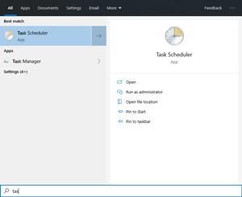
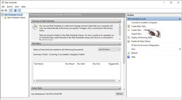
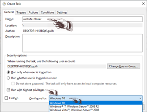
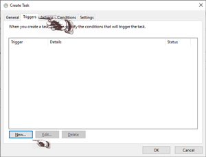
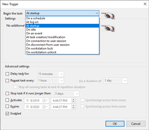
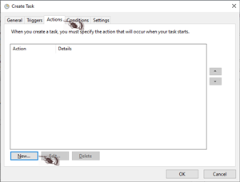
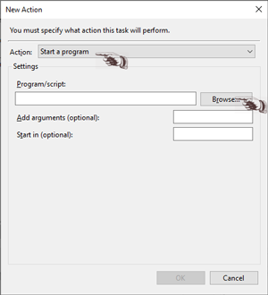
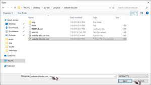
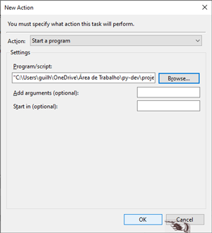
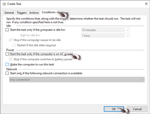

<!-- PROJECT SHIELDS -->
[![Build Status][build-shield]]()
[![Contributors][contributors-shield]]()
[![LinkedIn][linkedin-shield]][linkedin-url]


<!-- PROJECT LOGO -->
<br />
<p align="center">
  <a href="https://github.com/guiaramos/website-blocker.git>
    
  </a>

  <h1 align="center">Website Bloker</h1>

  <p align="center">
    A website blocker that runs at specific time for any OS and built with Python
    <br />
    <a href="https://github.com/guiaramos/website-blocker.git"><strong>Explore the docs »</strong></a>
    <br />
    <br />
    <a href="https://github.com/guiaramos/website-blocker.git">View Demo</a>
    ·
    <a href="https://github.com/guiaramos/website-blocker.git/issues">Report Bug</a>
    ·
    <a href="https://github.com/guiaramos/website-blocker.git/issues">Request Feature</a>
  </p>
</p>


<!-- TABLE OF CONTENTS -->
## Table of Contents

* [About the Project](#about-the-project)
  * [Built With](#built-with)
* [Getting Started](#getting-started)
  * [Prerequisites](#prerequisites)
  * [Installation](#installation)
    * [Windows](#windows)
    * [Linux and Mac](#Linux_and_Mac)
    * [Server](#Server_24hs)
* [Contact](#contact)


<!-- ABOUT THE PROJECT -->
## **About The Project**

![webmaps-volcanoes][product-screenshot]

This program simply takes the websites listed on the file site-list.txt and add to the hosts file redirecting to the local IP 127.0.0.1. This action makes the browser redirect the called address to "enpyt IP" causing the lost of site.

## Built With
This is the list of the tech stack:


#### **Code editor**
[![VS Code][VSCode-shield]][VScode-url]

#### **Back-End**
[![Python][Python-shield]][Python-url]

#### _Library_
[![Time][Time-shield]][Time-url]
[![Datetime][Datetime-shield]][Datetime-url]

#### _Database_
[![Hosts][Hosts-shield]][Hosts-url]
[![TXT][TXT-shield]][TXT-url]


<!-- GETTING STARTED -->
## Getting Started

To get a local copy up and running just follow the [Prerequisites](#prerequisites).

### Prerequisites
* Python 3
    * Time
    * Datetime

### Installation

Clone the repo:
```sh
git clone https://github.com/guiaramos/website-blocker.git
```

### _Windows_

`1. Open the"Task Scheduler":`



`2. Click on "Create Task":`



3. `Give it a name, check the heighest privileges box and select the windows:` 



4. `Select triggers, new:` 



5. `Select "At Start" and press ok:` 



6. `Select Actions, new:` 



7. `in Actio, select "Start a program":` 



8. Select the file website-blocker-win.pyw:` 



9. `And "OK:` 



3. `Finally, go to conditions and uncheck the box on power section: ` 



### _Linux and Mac_
1. `Open the Terminal and then the Crontab:`

```t
$ sudo crontab -e
```

2. `Add the following line by the end:`

```t
@reboot python3 /"LOCATION"/website_bloker-mac.py
```
<kbd>CTRL</kbd> + <kbd>X</kbd>

<kbd>Y</kbd>

<kbd>ENTER</kbd>

### _Server 24hs_

To set a Python script for execution on PythonAnywhere, follow these simple steps:

Sign up for a free account at https://www.pythonanywhere.com.

Go to your Dashboard, Files, Upload a File, and upload the Python file you want to schedule for execution.

Go to Tasks and set the time of the day you want your script to be executed and type in the name of the Python file you  uploaded (e.g., website-blocker-mac.py). 
>Note that the time you enter should be in UTC.

Click the Create button and you’re done.

<!-- CONTACT -->
## Contact

[![Gui][Gui-shield]][Gui-url]
[![LinkedIn][linkedin-shield]][linkedin-url]


<!-- MARKDOWN LINKS & IMAGES -->

[build-shield]: https://img.shields.io/badge/build-passing-brightgreen.svg?style=flat-square
[contributors-shield]: https://img.shields.io/badge/contributors-1-orange.svg?style=flat-square
[license-shield]: https://img.shields.io/badge/license-MIT-blue.svg?style=flat-square
[linkedin-shield]: https://img.shields.io/badge/-LinkedIn-black.svg?style=flat-square&logo=linkedin&colorB=555
[linkedin-url]: https://www.linkedin.com/in/guilhermearamos/
[product-screenshot]: img/program-img.png
[VSCode-shield]:https://img.shields.io/badge/-Visual%20Studio%20Code-lightgrey.svg?logo=visual-studio-code
[VScode-url]:https://code.visualstudio.com/docs
[Python-shield]:https://img.shields.io/badge/-Python-9cf.svg?logo=Python
[Python-url]:https://docs.python.org/3/
[Hosts-shield]:https://img.shields.io/badge/-Hosts-yellow.svg?logo=internet-explorer
[Hosts-url]:https://www.howtogeek.com/howto/27350/beginner-geek-how-to-edit-your-hosts-file/
[Gui-shield]:https://img.shields.io/badge/Guilherme%20Ramos-e--Mail-lightgrey.svg
[Gui-url]:gui_aramos@outlook.com
[HTML-shield]:https://img.shields.io/badge/-HTML-blue.svg?logo=HTML5
[HTML-url]:https://www.w3schools.com/html/html5_intro.asp
[TXT-shield]:https://img.shields.io/badge/-TXT-yellow.svg?logo=sublime-text
[TXT-url]: https://en.wikipedia.org/wiki/Comma-separated_values
[Time-shield]:https://img.shields.io/badge/-Time-green.svg?logo=Python
[Time-url]:https://docs.python.org/3/library/time.html
[Datetime-shield]:https://img.shields.io/badge/-Datetime-green.svg?logo=Python
[Datetime-url]:https://docs.python.org/3/library/datetime.html